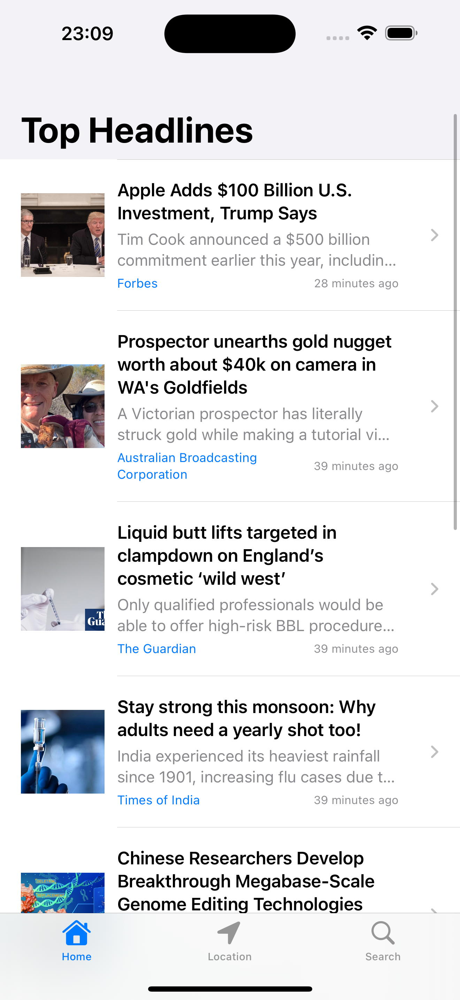
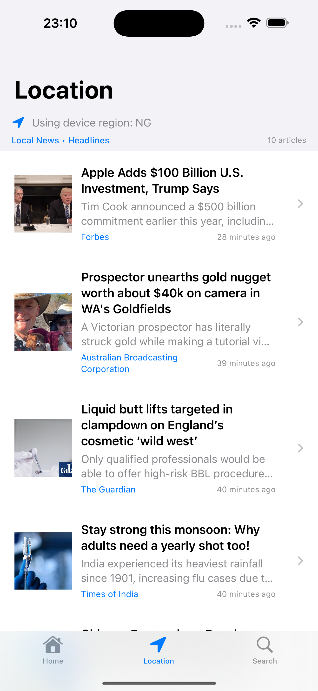

# GiftCard8Assessment - iOS News App

<div align="center">
  
  
  <p>A modern iOS news application built with SwiftUI that provides location-based news, search functionality, and offline caching capabilities.</p>
  
  
</div>

## Screenshots

<div align="center">
  
  
  
</div>

## Features

- 📰 **Latest News**: Browse current news articles
- 📍 **Location-Based News**: Get news relevant to your location
- 🔍 **Search Functionality**: Search for specific news topics
- 💾 **Offline Caching**: Read articles even when offline
- 🌐 **Web View Integration**: Read full articles in-app
- 🖼️ **Cached Images**: Optimized image loading and caching

## Architecture

The app follows MVVM (Model-View-ViewModel) architecture pattern:

- **Models**: Data structures for news articles
- **Views**: SwiftUI views for the user interface
- **ViewModels**: Business logic and state management
- **Services**: API communication, caching, and location services

## Project Structure

```
GiftCard8Assessment/
├── Models/           # Data models
├── Views/            # SwiftUI views
├── ViewModels/       # MVVM view models
├── Services/         # API and utility services
├── Extensions/       # Swift extensions
├── Config/           # Configuration files
└── Assets.xcassets/  # App assets
```

## Requirements

- iOS 15.0+
- Xcode 14.0+
- Swift 5.7+

## Setup

1. Clone the repository:
   ```bash
   git clone https://github.com/YOUR_USERNAME/GiftCard8Assessment.git
   cd GiftCard8Assessment
   ```

2. Open the project in Xcode:
   ```bash
   open GiftCard8Assessment.xcodeproj
   ```

3. Configure API keys:
   - Create your `Secrets.swift` file in the `Config` folder
   - Add your News API key and other required credentials

4. Build and run the project in Xcode

## Configuration

The app requires API keys for news services. Create a `Secrets.swift` file in the `Config` folder:

```swift
struct Secrets {
    static let newsAPIKey = "YOUR_NEWS_API_KEY"
    // Add other API keys as needed
}
```

## Key Components

### Services
- **NewsAPIService**: Handles news API communication
- **CacheService**: Manages offline data caching
- **LocationManager**: Handles location services

### Views
- **HomeView**: Main news feed
- **SearchView**: News search interface
- **LocationView**: Location-based news
- **NewsDetailView**: Individual article view
- **NewsRowView**: News list item component

### ViewModels
- **HomeViewModel**: Manages home screen state
- **SearchViewModel**: Handles search functionality
- **LocationViewModel**: Manages location-based features

## Contributing

1. Fork the repository
2. Create a feature branch (`git checkout -b feature/amazing-feature`)
3. Commit your changes (`git commit -m 'Add some amazing feature'`)
4. Push to the branch (`git push origin feature/amazing-feature`)
5. Open a Pull Request

## License

This project is available under the MIT License. See the LICENSE file for more info.

## Contact

Femi Aliu - femialiu713@gmail.com

Project Link: [https://github.com/graygoos/GiftCard8Assessment](https://github.com/YOUR_USERNAME/GiftCard8Assessment)
