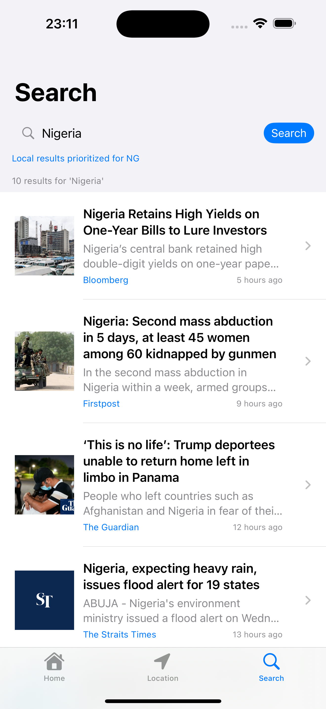

# GiftCard8Assessment - iOS News App

<div align="center">
  
  
  <p>A modern iOS news application built with SwiftUI that provides location-based news, search functionality, and offline caching capabilities.</p>
  
  
</div>

## Screenshots

<div align="center">
  
  
  
</div>

## Features

- 📰 **Latest News**: Browse current news articles
- 📍 **Location-Based News**: Get news relevant to your location
- 🔍 **Search Functionality**: Search for specific news topics
- 💾 **Offline Caching**: Read articles even when offline
- 🌐 **Web View Integration**: Read full articles in-app
- 🖼️ **Cached Images**: Optimized image loading and caching

## Architecture

The app follows MVVM (Model-View-ViewModel) architecture pattern:

- **Models**: Data structures for news articles
- **Views**: SwiftUI views for the user interface
- **ViewModels**: Business logic and state management
- **Services**: API communication, caching, and location services

## Project Structure

```
GiftCard8Assessment/
├── Models/           # Data models
├── Views/            # SwiftUI views
├── ViewModels/       # MVVM view models
├── Services/         # API and utility services
├── Extensions/       # Swift extensions
├── Config/           # Configuration files
└── Assets.xcassets/  # App assets
```

## Requirements

- iOS 17.0+
- Xcode 15.0+
- Swift 5.7+

## Setup

### 1. Clone the Repository
```bash
git clone https://github.com/YOUR_USERNAME/GiftCard8Assessment.git
cd GiftCard8Assessment
```

### 2. Get GNews API Key

This app uses [GNews API](https://gnews.io/) for fetching news articles. Follow these steps to get your API key:

1. **Visit GNews.io**: Go to [https://gnews.io/](https://gnews.io/)
2. **Sign Up**: Create a free account
3. **Get API Key**: After registration, you'll receive an API key
4. **Free Tier Limits**: 
   - 100 requests per day
   - Rate limit: 10 requests per minute
   - Access to top headlines and search endpoints

### 3. Configure API Key

**⚠️ Important Security Note**: Never commit API keys to version control!

1. **Create Secrets.swift**: Copy the template file and add your API key:
   ```bash
   cp GiftCard8Assessment/Config/Secrets.swift.template GiftCard8Assessment/Config/Secrets.swift
   ```

2. **Update Secrets.swift**: Replace the placeholder in `GiftCard8Assessment/Config/Secrets.swift`:
   ```swift
   struct Secrets {
       static let newsAPIKey = "YOUR_ACTUAL_API_KEY_HERE"
   }
   ```

3. **Alternative: Environment Variables** (Recommended for production):
   ```swift
   struct Secrets {
       static let newsAPIKey = ProcessInfo.processInfo.environment["GNEWS_API_KEY"] ?? ""
   }
   ```

### 4. API Endpoints Used

The app uses these GNews API endpoints:

- **Base URL**: `https://gnews.io/api/v4`
- **Top Headlines**: `/top-headlines?token={API_KEY}&lang=en`
- **Country News**: `/top-headlines?token={API_KEY}&lang=en&country={COUNTRY_CODE}`
- **Search**: `/search?token={API_KEY}&lang=en&q={QUERY}`

### 5. Supported Countries

GNews supports these country codes for location-based news:
- `us` - United States
- `gb` - United Kingdom  
- `ca` - Canada
- `au` - Australia
- `de` - Germany
- `fr` - France
- `in` - India
- `jp` - Japan
- And many more...

### 6. Open Project in Xcode
```bash
open GiftCard8Assessment.xcodeproj
```

### 7. Build and Run
- Select your target device/simulator
- Press `Cmd + R` to build and run

## API Configuration Details

### Rate Limiting
The app implements basic error handling for API rate limits. If you exceed the limits:
- Free tier: 100 requests/day, 10 requests/minute
- Consider upgrading to a paid plan for higher limits

### Error Handling
The `NewsAPIService` handles common API errors:
- Invalid API key
- Rate limit exceeded
- Network connectivity issues
- Invalid country codes

### Testing API Connection
To verify your API key works, you can test it directly:
```bash
curl "https://gnews.io/api/v4/top-headlines?token=YOUR_API_KEY&lang=en&max=1"
```

## Key Components

### Services
- **NewsAPIService**: Handles news API communication
- **CacheService**: Manages offline data caching
- **LocationManager**: Handles location services

### Views
- **HomeView**: Main news feed
- **SearchView**: News search interface
- **LocationView**: Location-based news
- **NewsDetailView**: Individual article view
- **NewsRowView**: News list item component

### ViewModels
- **HomeViewModel**: Manages home screen state
- **SearchViewModel**: Handles search functionality
- **LocationViewModel**: Manages location-based features

## Troubleshooting

### Common Issues

**"Invalid API Key" Error**
- Verify your API key is correct in `Secrets.swift`
- Check that you're using the GNews API key, not another news service
- Ensure there are no extra spaces or characters

**"Rate Limit Exceeded"**
- You've exceeded the free tier limits (100 requests/day)
- Wait for the limit to reset or upgrade your GNews plan
- Consider implementing request caching to reduce API calls

**No News Articles Loading**
- Check your internet connection
- Verify the API key is valid
- Check Xcode console for detailed error messages

**Location-Based News Not Working**
- Ensure location permissions are granted in iOS Settings
- Check that the country code is supported by GNews API
- Verify location services are enabled for the app

### Debug Mode
Enable debug logging by checking the console output in Xcode. The app logs API URLs and responses for troubleshooting.

## Security Best Practices

- **Never commit API keys**: The `Secrets.swift` file should be in `.gitignore`
- **Use environment variables**: For production deployments
- **Rotate keys regularly**: Generate new API keys periodically
- **Monitor usage**: Keep track of your API usage to avoid unexpected charges

## Contributing

1. Fork the repository
2. Create a feature branch (`git checkout -b feature/amazing-feature`)
3. Commit your changes (`git commit -m 'Add some amazing feature'`)
4. Push to the branch (`git push origin feature/amazing-feature`)
5. Open a Pull Request

**Note**: When contributing, never include your actual API keys in pull requests.

## License

This project is available under the MIT License. See the LICENSE file for more info.

## Contact

Femi Aliu - femialiu713@gmail.com

Project Link: [https://github.com/graygoos/GiftCard8Assessment](https://github.com/YOUR_USERNAME/GiftCard8Assessment)
